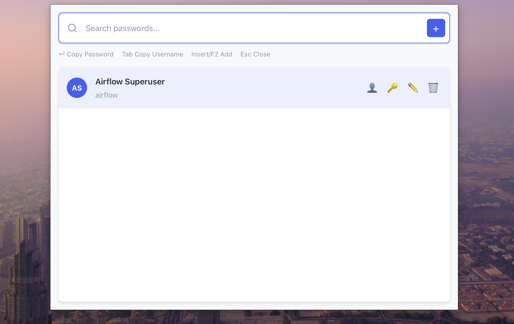
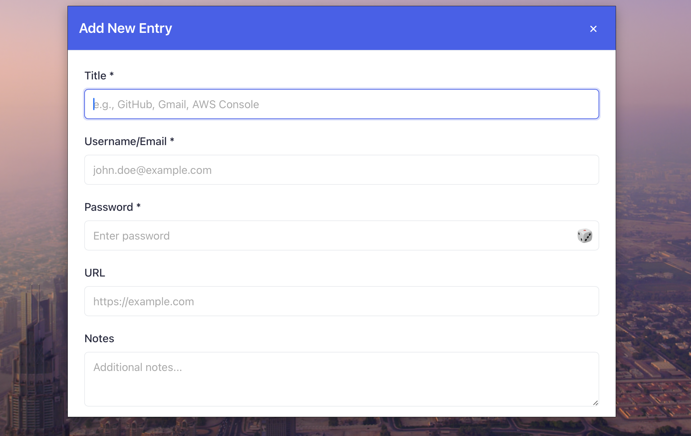

# Cocoon

### *Your Passwords, Safely Enfolded.*

-----

Cocoon is a secure, cross-platform password manager built with Rust, designed for speed and convenience. Inspired by the natural world's most protective enclosures, Cocoon keeps your digital credentials safely enfolded, accessible whenever you need them.

## Why Cocoon?

In today's digital landscape, strong, unique passwords are your first line of defense. But remembering them all is impossible, and typing them out is tedious. Cocoon offers a solution that balances ironclad security with ease of use, all built with the performance and safety guarantees of **Rust**.

-----

## Current Status

🎉 **MVP Available**: Cocoon is now running successfully on both **Windows** and **macOS** with core password management functionality.

**What's Working:**
- ✅ Secure password storage and retrieval with JSON persistence
- ✅ Cross-platform compatibility (Windows & macOS)
- ✅ **Global hotkey for quick access** (`Ctrl+Shift+C` on Windows, `Cmd+Alt+C` on macOS)
- ✅ **System tray integration** with click-to-show functionality
- ✅ **Auto-hide on focus loss** for enhanced security
- ✅ **Clipboard integration** for one-click password/username copying
- ✅ **Auto-start on system boot** capability
- ✅ Fast search and filtering across all password entries
- ✅ Full CRUD operations (Create, Read, Update, Delete) for password entries

**Coming Soon:**
- 🔄 Secure clipboard auto-clear after copying
- 🔄 Strong encryption for stored data (currently plain JSON)
- 🔄 Password generator with customizable options
- 🔄 Import/export functionality
- 🔄 Master password authentication

-----

## Key Features

### ✅ Current Features
- **Global Hotkey Access**: Quick access via `Ctrl+Shift+C` (Windows) or `Cmd+Alt+C` (macOS)
- **System Tray Integration**: Minimizes to system tray, click to show/hide
- **Smart Search**: Real-time filtering across titles, usernames, and URLs
- **One-Click Copy**: Copy passwords and usernames directly to clipboard
- **Auto-Hide Security**: Window automatically hides when focus is lost
- **Auto-Start**: Launches automatically when your system starts
- **Cross-Platform**: Native support for Windows and macOS
- **Fast & Lightweight**: Built with Rust and Tauri for optimal performance
- **Local Storage**: Your data stays on your machine in a local JSON file
- **Open Source**: Fully transparent codebase for security auditing

### 🚧 Planned Features
- **Strong Encryption**: Upgrade from JSON to encrypted storage with master password
- **Secure Clipboard**: Auto-clearing clipboard after copying passwords
- **Password Generator**: Create strong, unique passwords with customizable rules
- **Import Tools**: Migrate from other password managers (1Password, LastPass, etc.)
- **Data Backup**: Secure backup and restore functionality
- **Linux Support**: Expand to complete cross-platform coverage
- **Browser Extensions**: Direct integration with web browsers

-----

## Getting Started

### Prerequisites
- Windows 10+ or macOS 10.14+
- No additional dependencies required

### Installation

#### Option 1: Download Release (Recommended)
1. Visit our [Releases page](https://github.com/pesnik/cocoon/releases)
2. Download the appropriate binary for your platform:
   - `cocoon-windows.exe` for Windows
   - `cocoon-macos` for macOS
3. Run the application and set up your master password

#### Option 2: Build from Source
```bash
# Clone the repository
git clone https://github.com/pesnik/cocoon.git
cd cocoon

# Build for your platform
cargo build --release

# Run the application
# Windows: target/release/cocoon.exe
# macOS: target/release/cocoon
```

### First Time Setup
1. **Launch Cocoon** - The app will start minimized to your system tray
2. **Access via Hotkey**: Press `Ctrl+Shift+C` (Windows) or `Cmd+Alt+C` (macOS) to open
3. **Add Your First Password**: Click "Add New Entry" to start building your vault
4. **Quick Access**: Use the hotkey anytime to search and copy your passwords

### Daily Usage
- **Open Cocoon**: Use the global hotkey or click the system tray icon
- **Search**: Start typing to filter your password entries
- **Copy Credentials**: Click the copy buttons to get passwords/usernames to your clipboard
- **Auto-Hide**: The window automatically hides when you click elsewhere for security

-----

## Usage

### Usage

**Opening Cocoon:**
- **Global Hotkey**: `Ctrl+Shift+C` (Windows) or `Cmd+Alt+C` (macOS)
- **System Tray**: Click the Cocoon icon in your system tray
- **Auto-Start**: Cocoon launches automatically when your system starts

**Managing Passwords:**
1. **Add New Entry**: Fill in website, username, password, and optional notes
2. **Search & Filter**: Type to instantly filter entries by title, username, or URL
3. **Copy Credentials**: One-click copy for passwords and usernames
4. **Edit/Delete**: Modify or remove entries as needed

**Security Features:**
- **Auto-Hide**: Window hides automatically when you click elsewhere
- **Local Storage**: All data stored locally in `~/.local/share/cocoon-password-manager/` (Linux/macOS) or `%APPDATA%/cocoon-password-manager/` (Windows)
- **No Network Access**: Your passwords never leave your device

-----

## Screenshots

Get a glimpse of Cocoon's intuitive interface:

| **Main Interface** | **Add New Entry** | **Search & Filter** |
|-------------------|-------------------|-------------------|
|  |  |  |
| Your secure password vault | Simple form for new credentials | Quick search and filtering |

*Screenshots reflect the current MVP version and may evolve with future updates.*

-----

## Development

### Building from Source

Ensure you have Rust installed (visit [rustup.rs](https://rustup.rs/) for installation instructions).

```bash
# Clone and build
git clone https://github.com/pesnik/cocoon.git
cd cocoon
cargo build --release

# Run tests
cargo test

# Run in development mode
cargo run
```

### Platform-Specific Notes

**Windows:**
- Builds require Windows 10 SDK
- Executable will be in `target/release/cocoon.exe`

**macOS:**
- Requires Xcode command line tools
- Binary will be in `target/release/cocoon`
- May need to allow in Security & Privacy settings

-----

## Roadmap

### v1.0 (Current MVP) ✅
- [x] Password storage and retrieval with local JSON persistence
- [x] Cross-platform support (Windows & macOS)
- [x] Global hotkey access (`Ctrl+Shift+C` / `Cmd+Alt+C`)
- [x] System tray integration with click-to-show
- [x] Auto-hide on focus loss for security
- [x] One-click clipboard copying for passwords/usernames
- [x] Real-time search and filtering
- [x] Auto-start capability
- [x] Full CRUD operations for password entries

### v1.1 (Security & UX Improvements)
- [ ] **Strong encryption** - Replace JSON with encrypted storage
- [ ] **Master password authentication** - Secure access to your vault
- [ ] **Secure clipboard management** - Auto-clear clipboard after copying
- [ ] **Password strength indicator** - Visual feedback on password security
- [ ] **Backup/restore functionality** - Secure data backup options

### v1.2 (Advanced Features)
- [ ] **Password generator** - Create strong passwords with custom rules
- [ ] **Import/export tools** - Migrate from other password managers
- [ ] **Categories and tags** - Better organization for large password collections
- [ ] **Password history** - Track password changes over time
- [ ] **Secure notes** - Store sensitive information beyond passwords

-----

## Contributing

Cocoon is open source and welcomes contributions! Whether you're reporting bugs, suggesting features, or submitting code, your help makes Cocoon better.

**Ways to Contribute:**
- 🐛 Report bugs via [GitHub Issues](https://github.com/pesnik/cocoon/issues)
- 💡 Suggest features or improvements
- 🔧 Submit pull requests
- 📖 Improve documentation
- 🔐 Security audits and reviews

Please see our [CONTRIBUTING.md](CONTRIBUTING.md) for detailed guidelines.

-----

## Security

**Current Security Features:**
- **Local-Only Storage**: Your passwords never leave your device
- **Memory-Safe Implementation**: Built with Rust to prevent common security vulnerabilities
- **Auto-Hide Protection**: Window automatically hides when focus is lost
- **No Network Access**: Cocoon operates entirely offline

**Important Security Note:** 
The current MVP stores passwords in a local JSON file for rapid development and testing. **This is not suitable for production use with sensitive data.** The next major update will implement strong encryption with a master password.

**Planned Security Enhancements:**
- **AES-256 GCM encryption** for data at rest
- **Argon2** key derivation function for master password
- **Zero-knowledge architecture** - only you can decrypt your data
- **Secure memory handling** for sensitive operations
- **Optional two-factor authentication**

Found a security issue? Please report it privately to [security@cocoon-pm.com](mailto:security@cocoon-pm.com).

-----

## License

Cocoon is distributed under the [MIT License](LICENSE). See the LICENSE file for full details.

-----

## Community

Join the conversation and stay updated:

- **GitHub**: [pesnik/cocoon](https://github.com/pesnik/cocoon)
- **Issues**: [Report bugs or request features](https://github.com/pesnik/cocoon/issues)
- **Discussions**: [Community discussions](https://github.com/pesnik/cocoon/discussions)

-----

**Cocoon: Your Digital World, Securely Enfolded.**

---

*Built with ❤️ and Rust for security, performance, and peace of mind.*